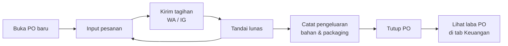
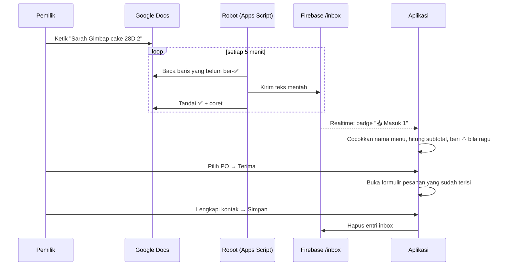
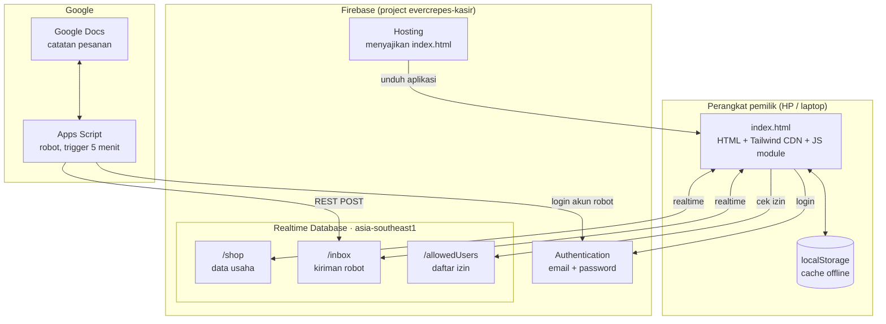

# 4ever Crepes Kasir — Dokumentasi Produk & Teknis

> Aplikasi kasir berbasis web untuk usaha **Pre-Order (PO)**: mencatat pesanan per batch PO,
> mengirim rincian tagihan ke customer lewat WhatsApp/Instagram dalam satu klik,
> dan menghitung omzet serta laba per PO.

| | |
|---|---|
| **Status** | Dipakai di production oleh 1 usaha (4ever Crepes) |
| **URL production** | https://evercrepes-kasir.web.app |
| **Versi dokumen** | 27 September 2026 |
| **Kode** | `index.html` (±2.300 baris) + `robot-apps-script.gs` (±190 baris) |

> ⚠️ **Dua hal yang perlu diketahui sebelum membaca lebih jauh**
> 1. Aplikasi ini **belum** Progressive Web App (PWA) — belum ada *web manifest* maupun
>    *service worker*. Lihat [L-01](#7-batasan-yang-diketahui) dan [bagian 8](#8-kesiapan-untuk-dijual-ke-umkm).
> 2. Arsitekturnya masih **single-tenant** (satu usaha per instalasi). Untuk dijual ke
>    banyak UMKM, ada keputusan arsitektur yang harus diambil dulu — lihat
>    [bagian 8](#8-kesiapan-untuk-dijual-ke-umkm).

---

## Daftar Isi

1. [Masalah yang diselesaikan](#1-masalah-yang-diselesaikan)
2. [Fitur](#2-fitur)
3. [Alur utama](#3-alur-utama)
4. [Arsitektur](#4-arsitektur)
5. [Model data](#5-model-data)
6. [Deployment & operasional](#6-deployment--operasional)
7. [Batasan yang diketahui](#7-batasan-yang-diketahui)
8. [Kesiapan untuk dijual ke UMKM](#8-kesiapan-untuk-dijual-ke-umkm)
9. [Decision log](#9-decision-log)
10. [Riwayat versi](#10-riwayat-versi)

---

## 1. Masalah yang diselesaikan

Usaha PO skala rumahan biasanya mengelola pesanan dengan catatan di chat, Notes, atau Word.
Masalah yang muncul:

- **Rekap manual yang berulang.** Pesanan dicatat di satu tempat, lalu diketik ulang ke tempat lain.
- **Menagih satu per satu.** Setiap customer perlu dikirimi rincian pesanan dan total yang dihitung manual.
- **Tidak tahu untung-rugi per batch.** Pengeluaran bahan tercampur, omzet tercampur ongkir.
- **Lupa siapa yang sudah bayar.**

Aplikasi ini menjadikan **batch PO** sebagai unit kerja utama: buka PO → kumpulkan pesanan →
tagih → tandai lunas → tutup PO → lihat laba PO tersebut.

---

## 2. Fitur

| Tab | Fitur |
|---|---|
| 📋 **PO** | Buka beberapa PO sekaligus · daftar pesanan per PO · ringkasan omzet & status lunas · rekap total qty per menu (untuk belanja/produksi) · tutup PO |
| 📥 **Masuk** | Kotak masuk pesanan dari Google Docs · pencocokan nama menu otomatis · peringatan ⚠️ untuk tulisan yang meragukan · terima ke PO tertentu atau buang |
| 🍴 **Menu** | Tambah/ubah/hapus menu dan harga |
| 👥 **Customer** | Daftar customer otomatis dari pesanan · deduplikasi berdasarkan WA/IG · riwayat & total belanja per customer |
| 📁 **Riwayat** | PO yang sudah ditutup · bisa dibuka kembali |
| 💰 **Keuangan** | Pengeluaran per PO atau "Biaya Umum" · 5 kategori tetap · kartu Omzet / Lunas / Pengeluaran / Laba bersih + margin % |
| ⚙️ **Pengaturan** | Nama usaha · info pembayaran · template pesan · ekspor/impor data JSON · reset |

**Formulir pesanan:** nama (opsional), WA dan/atau IG (minimal salah satu), item dari menu
dengan kolom pencarian, ongkir, diskon, catatan, status lunas. Kolom nama, WA, dan IG
memiliki *autocomplete* dari data customer.

**Pengiriman pesan:**
- **WhatsApp** — membuka `wa.me/62xxx?text=...` dengan pesan terisi. Nomor dinormalisasi otomatis (`08…` / `8…` / `620…` → `628…`).
- **Instagram** — pesan disalin ke clipboard lalu membuka `ig.me/m/<username>`, karena Instagram tidak mendukung teks terisi otomatis.

**Template pesan** dapat diubah di Pengaturan. Placeholder yang tersedia:
`{nama}` `{po}` `{bisnis}` `{items}` `{rincian}` `{catatan}` `{pembayaran}`.

---

## 3. Alur utama

### Alur A — Siklus satu PO (alur inti)



1. Pemilik membuka PO (mis. "PO Sabtu 16 Agustus").
2. Setiap pesanan masuk diinput; customer baru otomatis tersimpan.
3. Dari kartu pesanan, tombol **WA** atau **IG** mengirim rincian tagihan.
4. Setelah transfer diterima, pesanan ditandai **lunas**.
5. Kartu **Total Pesanan** di detail PO menunjukkan total qty per menu — dipakai untuk belanja dan produksi.
6. Pengeluaran dicatat dan ditautkan ke PO.
7. PO ditutup dan pindah ke Riwayat; laba bersihnya terlihat di tab Keuangan.

### Alur B — Pesanan dari Google Docs (tanpa ketik ulang)



**Format catatan di Google Docs** — satu baris satu pesanan:

```
Sarah Gimbap cake 28D 2
Dina Dubai cookie 2, Mini Bites 1
Lia mini bites
# baris yang diawali pagar tidak akan dikirim (catatan pribadi)
```

- Nama customer di depan, lalu nama menu, lalu jumlah.
- Beberapa menu dipisah koma.
- Jumlah boleh ditulis `2` atau `x2`; tanpa angka dianggap 1.
- Kontak (WA/IG), ongkir, dan diskon dilengkapi di aplikasi saat menekan **Terima**.

### Alur C — Keuangan

- **Omzet** = subtotal − diskon (**tanpa ongkir**).
- **Lunas** = omzet dari pesanan yang sudah ditandai lunas.
- **Laba bersih** = omzet − pengeluaran yang tertaut ke PO tersebut.
- Tampilan "📌 Biaya Umum" untuk pengeluaran yang tidak terkait PO tertentu.

---

## 4. Arsitektur



### Komponen

| Komponen | Teknologi | Peran |
|---|---|---|
| Aplikasi | Satu file `index.html`: HTML, Tailwind CSS (CDN), JavaScript ES module, Firebase JS SDK 10.13 | Seluruh UI dan logika bisnis, termasuk mesin pembaca Kotak Masuk |
| Cache offline | `localStorage` (key `4ever-crepes-state-v1`) | Data tetap tampil saat offline atau sebelum Firebase tersambung |
| Database | Firebase Realtime Database, region `asia-southeast1` | Sumber data utama, sinkron realtime antar perangkat |
| Autentikasi | Firebase Auth (email + password) + whitelist `/allowedUsers` | Hanya UID yang terdaftar yang bisa membaca/menulis data |
| Hosting | Firebase Hosting, header `no-cache` untuk HTML | Pengguna selalu mendapat versi terbaru setelah deploy |
| Robot | Google Apps Script *standalone*, trigger waktu 5 menit | Memindahkan baris baru dari Google Docs ke `/inbox` |

### Keamanan

**Security rules** (diatur di Firebase Console, tidak ada di repo):

```json
{
  "rules": {
    "allowedUsers": {
      "$uid": { ".read": "auth != null && auth.uid === $uid" }
    },
    "shop": {
      ".read":  "auth != null && root.child('allowedUsers').child(auth.uid).val() === true",
      ".write": "auth != null && root.child('allowedUsers').child(auth.uid).val() === true"
    },
    "inbox": {
      ".read":  "auth != null && root.child('allowedUsers').child(auth.uid).val() === true",
      ".write": "auth != null && root.child('allowedUsers').child(auth.uid).val() === true"
    }
  }
}
```

- Siapa pun bisa mendaftar akun, tetapi tanpa entri di `/allowedUsers` akun itu hanya melihat layar
  **"Akses Ditolak"** (dengan tombol salin UID agar mudah didaftarkan admin).
- Konfigurasi Firebase di `index.html` (apiKey, databaseURL) **memang publik** untuk aplikasi web;
  keamanan bergantung pada rules di atas, bukan pada kerahasiaan konfigurasi.
- Password akun robot disimpan di **Script Properties** Apps Script, tidak pernah di kode.

### Mesin pembaca Kotak Masuk

Logika pencocokan berjalan di aplikasi (bukan di robot), karena aplikasi memegang daftar menu terkini.
Untuk setiap baris:

1. Pecah per koma → setiap potongan = satu item. Potongan pertama juga memuat nama customer.
2. Deteksi jumlah: `x2` / `*2` (pasti jumlah), atau angka polos di akhir (bisa jumlah, bisa bagian nama menu — keduanya dicoba).
3. Cari menu sebagai **akhiran** teks. Sisa teks di depan = nama customer (huruf besar-kecil dipertahankan).
4. Toleransi salah ketik dengan jarak Levenshtein: 0 huruf (nama ≤ 5 karakter), 1 (≤ 10), 2 (lebih panjang).
5. **Aturan keras:** angka pada nama menu harus identik — `28D` tidak pernah dicocokkan dengan `20d`.
6. Bila seri, nama menu **terpanjang** menang (`Peach gum paket` > `Peach gum`).
7. Setiap tebakan yang tidak persis diberi ⚠️. Menu yang tidak ditemukan tidak pernah ditebak.

Diuji dengan 14 kasus, termasuk semua jebakan di atas (14/14 lulus).

---

## 5. Model data

### Di memori aplikasi

```js
state = {
  business:  { name, payment, template },
  menu:      [{ id, name, price }],
  pos:       [{ id, name, date, status: 'active' | 'closed',
                orders: [{ id, customerName, customerWA, customerIG,
                           items: [{ menuId, qty }],
                           shipping, discount, paid, notes }] }],
  customers: [{ id, name, wa, ig, createdAt, lastOrderAt }],
  expenses:  [{ id, date, category, amount, notes, poId?, createdAt }]
}

inbox = [{ id, text, createdAt, source: 'doc' }]   // terpisah dari state
```

### Di Firebase

```
/shop                 ← seluruh `state`; array disimpan sebagai objek ber-key id
/inbox/{pushId}       ← { text, createdAt, source }
/allowedUsers/{uid}   = true
```

Array dikonversi ke objek ber-key `id` (`arrayToObj` / `objToArray`) karena Realtime Database
tidak menyimpan array secara andal.

### Rumus

| Nama | Rumus | Dipakai di |
|---|---|---|
| `calcOrderTotal` | subtotal + ongkir − diskon | Tampilan per pesanan, pesan WA/IG (yang dibayar customer) |
| `calcOrderOmzet` | subtotal − diskon | Semua agregat: ringkasan PO, Riwayat, total customer, Keuangan |

---

## 6. Deployment & operasional

### Alur rilis

```bash
# 1. Uji di preview channel (URL terpisah, kedaluwarsa otomatis)
firebase.cmd hosting:channel:deploy <nama-uji> --expires 7d

# 2. Setelah dites di HP: simpan ke git dan GitHub
git add . && git commit -m "ringkasan perubahan" && git push

# 3. Rilis ke production
firebase.cmd deploy --only hosting
```

> ⚠️ Preview channel dan production **memakai database yang sama**. Data yang dibuat saat uji
> masuk ke data asli.

### Rollback

- **Kode:** Firebase Console → Hosting → Release history → pilih versi → Rollback.
- **Data:** tidak ada backup otomatis. Ekspor manual lewat ⚙️ Pengaturan → Ekspor, atau Firebase Console → Export JSON.

### File yang dipublikasikan hosting

`firebase.json` menyajikan folder proyek sebagai situs, dengan pengecualian: file/folder berawalan
titik (termasuk `.git`), `backups/`, `*.md`, dan `*.gs`. Hanya `index.html` yang seharusnya
dapat diakses publik.

### Robot Google Docs

| Fungsi di Apps Script | Kegunaan |
|---|---|
| `cekKoneksi` | Uji baca dokumen dan login robot, tanpa mengirim apa pun |
| `kirimPesanan` | Kirim semua baris baru sekarang (fungsi yang dijalankan trigger) |
| `pasangJadwal` | Pasang trigger 5 menit (menghapus trigger lama agar tidak ganda) |
| `matikanJadwal` | Hentikan robot |

Script Properties yang wajib diisi: `ROBOT_EMAIL`, `ROBOT_PASSWORD`, `DOC_ID` (boleh URL lengkap dokumen).

---

## 7. Batasan yang diketahui

| ID | Batasan | Dampak | Arah perbaikan |
|---|---|---|---|
| L-01 | Belum PWA (tanpa manifest & service worker) | Tidak bisa dipasang sebagai aplikasi dengan ikon & layar penuh; tidak bisa dibuka saat offline dari awal | Tambah `manifest.webmanifest`, ikon, dan service worker |
| L-02 | Single-tenant: konfigurasi Firebase ditulis langsung di kode, satu `/shop` | Satu instalasi = satu usaha | Lihat bagian 8 |
| L-03 | `saveState()` menulis ulang seluruh `/shop` dengan `set()` | Dua perangkat menyimpan bersamaan → perubahan salah satu bisa hilang (*last write wins*). Setiap simpan mengunggah seluruh data, sehingga pemakaian bandwidth tumbuh seiring data | Tulis per-path dengan `update()` (mis. hanya `/shop/pos/{id}/orders/{id}`) |
| L-04 | Pendaftaran akun terbuka untuk siapa saja | Aman karena whitelist, tetapi bisa muncul akun sampah | Matikan sign-up publik atau ganti dengan undangan |
| L-05 | Tailwind dimuat dari CDN versi *play* | Bergantung pada CDN pihak ketiga; tidak disarankan untuk production | Build Tailwind menjadi file CSS statis |
| L-06 | Nilai bawaan masih spesifik 4ever Crepes (nama usaha, key localStorage, contoh rekening) | Perlu disesuaikan tiap klien | Jadikan konfigurasi |
| L-07 | Tidak ada backup otomatis | Kehilangan data bila terhapus | Backup terjadwal (mis. ekspor harian ke Google Drive lewat Apps Script) |
| L-08 | Robot: jeda hingga 5 menit; bila pengiriman sukses tetapi penandaan ✅ gagal, baris bisa terkirim dua kali | Kecil; entri ganda bisa dibuang di Kotak Masuk | Kirim ID unik per baris agar penulisan idempoten |
| L-09 | Pemasangan robot teknis (Apps Script, layar "unverified app", Script Properties) | Sulit dilakukan sendiri oleh UMKM | Dipasangkan oleh penjual, atau ganti kanal input |
| L-10 | Belum ada tes otomatis di repo | Regresi mesin pembaca tidak terdeteksi | Pindahkan 14 kasus uji ke folder `tests/` |

---

## 8. Kesiapan untuk dijual ke UMKM

### Keputusan terbesar: satu instalasi per klien, atau satu sistem untuk semua klien?

| | **Opsi A — Satu project Firebase per klien** | **Opsi B — Multi-tenant (SaaS)** |
|---|---|---|
| Cara kerja | Setiap klien punya project Firebase, URL, dan database sendiri | Semua klien di satu project; data dipisah `/shops/{shopId}` |
| Perubahan kode | Kecil: konfigurasi dikeluarkan dari kode | Besar: model data, rules, pendaftaran, manajemen anggota |
| Isolasi data | Sangat kuat (terpisah total) | Bergantung pada ketepatan security rules |
| Biaya server | Umumnya gratis per klien (Spark plan) | Satu tagihan, naik seiring jumlah klien |
| Update aplikasi | Deploy ke N project | Deploy sekali untuk semua |
| Cocok untuk | ≤ 10–20 klien, dijual sebagai jasa pasang | Puluhan–ratusan klien, langganan bulanan |

Rekomendasi awal: **mulai dengan Opsi A** untuk beberapa klien pertama (validasi pasar dengan
perubahan kode minimal), lalu pindah ke Opsi B setelah model bisnis terbukti. Keputusan akhir
belum diambil — lihat D-22.

### Daftar yang perlu dikerjakan sebelum dijual

- [ ] Putuskan Opsi A atau B (D-22)
- [ ] Nama produk & white-label (nama usaha, warna, logo dari pengaturan)
- [ ] PWA (L-01) — yang membuat aplikasi terasa seperti aplikasi HP sungguhan
- [ ] Perbaiki penyimpanan per-path (L-03) sebelum ada klien yang memakai lebih dari satu perangkat
- [ ] Backup otomatis (L-07)
- [ ] Repo GitHub dijadikan private
- [ ] Istilah generik: "Menu" → "Produk" bila menyasar PO non-makanan
- [ ] Syarat & ketentuan + kebijakan privasi — aplikasi menyimpan nama dan nomor HP customer,
      sehingga tunduk pada UU No. 27 Tahun 2022 tentang Pelindungan Data Pribadi
- [ ] Panduan pemakaian untuk klien (bahasa awam)

---

## 9. Decision log

Format: **Konteks** → **Keputusan** → **Alasan** → **Alternatif yang ditolak**.

### D-01 · Satu file HTML tanpa build step
- **Konteks:** Pemilik bukan programmer; perubahan sering dibantu AI.
- **Keputusan:** Seluruh aplikasi dalam `index.html` (HTML + Tailwind CDN + JS module).
- **Alasan:** Tidak perlu Node, bundler, atau `npm install`; satu file mudah dibaca dan di-deploy.
- **Ditolak:** React/Next.js — lebih rapi untuk skala besar, tetapi menambah rantai build.
- **Konsekuensi:** File panjang (±2.300 baris); fungsi yang dipanggil dari `onclick` wajib didaftarkan ke `window` karena kode berjalan sebagai module.

### D-02 · Firebase Realtime Database, region Singapura
- **Keputusan:** RTDB di `asia-southeast1`.
- **Alasan:** Sinkron realtime antar HP tanpa server sendiri; latensi rendah dari Indonesia; free tier cukup untuk usaha kecil.
- **Ditolak:** Firestore (model query lebih kaya, tetapi belum dibutuhkan); server sendiri.
- **Catatan:** CLI `firebase database:get` bermasalah untuk database regional; backup lebih andal lewat Console.

### D-03 · localStorage sebagai cache offline
- **Alasan:** Aplikasi tetap menampilkan data terakhir saat sinyal hilang.
- **Batas:** Bukan offline-first penuh — halaman tetap harus dimuat dari internet (L-01).

### D-04 · Whitelist UID, bukan pendaftaran terbuka
- **Keputusan:** Login email + password; akses data hanya untuk UID di `/allowedUsers`.
- **Alasan:** Cara paling sederhana membatasi akses ke keluarga/tim tanpa sistem peran.
- **Konsekuensi:** Menambah pengguna dilakukan manual di Firebase Console (dibantu tombol salin UID).

### D-05 · Array disimpan sebagai objek ber-key id
- **Alasan:** Realtime Database menyimpan array secara tidak konsisten ketika elemen dihapus.

### D-06 · Omzet tidak termasuk ongkir
- **Keputusan:** Pisahkan `calcOrderTotal` (yang dibayar customer) dan `calcOrderOmzet` (pendapatan usaha).
- **Alasan:** Ongkir adalah titipan untuk kurir, bukan pendapatan. Memasukkannya membuat omzet dan margin terlihat lebih besar dari kenyataan.

### D-07 · Customer diidentifikasi dari WA/IG, bukan nama
- **Alasan:** Nama sering ditulis berbeda-beda atau kosong; nomor WA dan username IG unik.
- **Keputusan turunan:** Nama opsional; customer tidak disimpan bila WA dan IG sama-sama kosong; bila terdeteksi duplikat, data yang kosong dilengkapi.

### D-08 · Keuangan per PO, bukan per bulan
- **Alasan:** Usaha PO berpikir per batch ("PO ini untung berapa?"), bukan per bulan kalender.
- **Keputusan turunan:** Opsi "Biaya Umum" untuk pengeluaran lintas PO; kategori tetap agar laporan konsisten.

### D-09 · Instagram lewat clipboard + `ig.me`
- **Alasan:** Tautan Instagram tidak mendukung teks terisi otomatis seperti `wa.me`.

### D-10 · Header `no-cache` untuk HTML
- **Alasan:** Tanpa ini, HP pengguna bisa terus memakai versi lama setelah deploy.

### D-11 · Pemilih menu berupa kolom pencarian
- **Tanggal:** 15 Agustus 2026
- **Konteks:** Menu bertambah banyak; dropdown panjang merepotkan di HP.
- **Keputusan:** Ganti `<select>` dengan kolom ketik + daftar saran. Saat diklik, semua menu tetap tampil.
- **Detail:** Teks yang diketik tanpa memilih dikembalikan ke menu yang terpilih, agar tidak ada nilai menggantung.

### D-12 · Input pesanan lewat Google Docs, bukan Google Sheets
- **Tanggal:** 15 Agustus 2026
- **Konteks:** Pemilik terbiasa mencatat pesanan di dokumen lalu mengetik ulang ke aplikasi.
- **Keputusan:** Google Docs, satu baris satu pesanan.
- **Alasan:** Mengetik bebas jauh lebih cepat di HP daripada mengisi sel tabel. Dokumen di cloud tetap bisa diproses walau laptop mati.
- **Ditolak:** Google Sheets (lebih mudah diproses mesin, tetapi merepotkan saat mengetik); file Word di laptop (hanya jalan saat laptop menyala); salin-tempel manual ke aplikasi (pemilik menginginkan otomatis penuh).

### D-13 · Format baris `Nama Menu Jumlah`; kontak diisi di aplikasi
- **Keputusan:** Baris hanya berisi nama, menu, dan jumlah. WA/IG/ongkir/diskon dilengkapi saat Terima.
- **Alasan:** Format sependek mungkin agar kebiasaan mencatat tidak berubah; kolom kontak di aplikasi sudah punya autocomplete.

### D-14 · Robot "bodoh", logika di aplikasi
- **Keputusan:** Robot hanya mengirim teks mentah; pencocokan menu dilakukan aplikasi.
- **Alasan:** Daftar menu hidup di aplikasi. Menu baru langsung dikenali tanpa mengubah robot.

### D-15 · Lebih baik bertanya daripada menebak
- **Keputusan:** Angka pada nama menu harus identik; nama terpanjang menang; tebakan diberi ⚠️; menu tak dikenal tidak pernah ditebak.
- **Alasan:** Menu seperti `Gimbap cake 20d` / `28D` / `60d` hanya berbeda angka. Toleransi salah ketik yang longgar bisa diam-diam mengubah pesanan Rp160.000 menjadi Rp235.000 dan merusak laporan omzet.

### D-16 · Manusia menyetujui setiap pesanan dari Docs (human-in-the-loop)
- **Keputusan:** Pesanan masuk ke Kotak Masuk; tombol **Terima** membuka formulir pesanan yang sudah ada, terisi otomatis.
- **Alasan:** Kesalahan baca terlihat sebelum menjadi data penjualan. Memakai ulang formulir lama berarti autocomplete, simpan-customer otomatis, dan perhitungan total tetap memakai kode yang sudah teruji.
- **Ditolak:** Pesanan langsung tersimpan otomatis; formulir baru khusus Kotak Masuk.

### D-17 · Node `/inbox` terpisah dari `/shop`
- **Konteks:** `saveState()` menimpa seluruh `/shop` dengan `set()`.
- **Keputusan:** Kiriman robot disimpan di `/inbox`, dibaca dengan listener terpisah, dihapus per entri.
- **Alasan:** Bila berada di dalam `/shop`, kiriman robot akan terhapus setiap kali aplikasi menyimpan data dari perangkat yang belum menerimanya.

### D-18 · Akun robot terpisah, Apps Script standalone
- **Keputusan:** Robot login dengan akun khusus (alias `+robot` dari email pemilik); password di Script Properties; project Apps Script berdiri sendiri, tidak menempel di dokumen.
- **Alasan:** Akun terpisah bisa dicabut tanpa mengganggu akun pemilik. Script yang menempel di dokumen ikut terbagikan saat dokumen dibagikan.
- **Ditolak:** Memakai akun pemilik; service account (lebih aman secara teori, tetapi terlalu rumit dipasang oleh non-programmer).

### D-19 · Baris yang terkirim ditandai ✅ + dicoret
- **Alasan:** Google Docs tidak punya kolom status. Tanda terlihat oleh pemilik dan dipakai robot untuk melewati baris. Penandaan dilakukan tepat setelah setiap baris berhasil dikirim.

### D-20 · Git + GitHub; riwayat digabung, bukan ditimpa
- **Tanggal:** 27 September 2026
- **Konteks:** Repo GitHub sudah berisi satu unggahan manual `index.html` (Mei 2026) yang tidak punya riwayat bersama dengan git lokal.
- **Keputusan:** Gabungkan dengan `--allow-unrelated-histories`; versi lokal dipakai sebagai isi terkini.
- **Ditolak:** *Force push* — akan menghapus unggahan lama.

### D-21 · Hosting tidak lagi menyajikan `.git` dan file non-aplikasi
- **Tanggal:** 27 September 2026
- **Konteks:** Pola `**/.*` hanya mengecualikan *file* berawalan titik. Isi folder `.git` (mis. `/.git/HEAD`, `/.git/config`) ternyata bisa diunduh publik dari URL production.
- **Keputusan:** Tambahkan `**/.*/**`, `backups/**`, `**/*.md`, `**/*.gs` ke daftar pengecualian.
- **Dampak saat ditemukan:** Rendah — isinya sama dengan repo GitHub yang publik dan tidak mengandung password. Tetapi bila repo dijadikan private, kebocoran ini akan membatalkannya.

### D-22 · (Terbuka) Model penjualan: per klien atau multi-tenant
- **Status:** Belum diputuskan. Lihat [bagian 8](#8-kesiapan-untuk-dijual-ke-umkm).

---

## 10. Riwayat versi

| Tanggal | Commit | Perubahan |
|---|---|---|
| 2026-05-06 | `46d6db8` | Unggahan awal ke GitHub (versi lama) |
| 2026-08-15 | `961674b` | Titik awal git: versi yang berjalan di production |
| 2026-08-15 | `cd08e71` | Pemilih menu bisa dicari dengan mengetik |
| 2026-08-15 | `49adcc6` | Tab Kotak Masuk + mesin pembaca pesanan |
| 2026-08-15 | `39b4597` | Robot Apps Script: Google Docs → `/inbox` |
| 2026-08-15 | `776ae3d` | Robot menerima URL dokumen utuh sebagai `DOC_ID` |
| 2026-09-27 | `62917bb` | Riwayat lokal digabung dengan repo GitHub |
| 2026-09-27 | — | Dokumentasi ini + pengetatan file yang dipublikasikan hosting |
