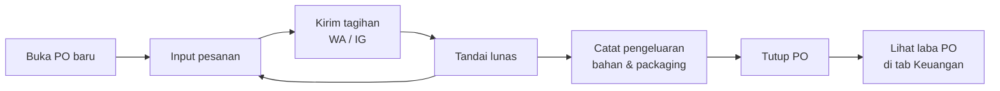
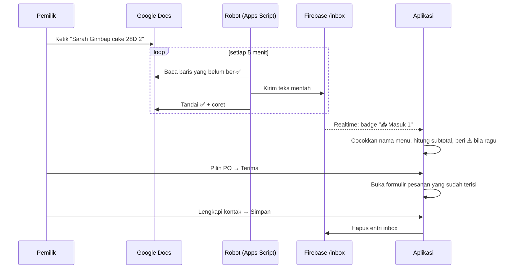

# 3. Alur utama

## Alur A — Siklus satu PO (alur inti)



1. Pemilik membuka PO (mis. "PO Sabtu 16 Agustus").
2. Setiap pesanan masuk diinput; customer baru otomatis tersimpan.
3. Dari kartu pesanan, tombol **WA** atau **IG** mengirim rincian tagihan.
4. Setelah transfer diterima, pesanan ditandai **lunas**.
5. Kartu **Total Pesanan** di detail PO menunjukkan total qty per menu — dipakai untuk belanja dan produksi.
6. Pengeluaran dicatat dan ditautkan ke PO.
7. PO ditutup dan pindah ke Riwayat; laba bersihnya terlihat di tab Keuangan.

## Alur B — Pesanan dari Google Docs (tanpa ketik ulang)



**Format catatan di Google Docs** — satu baris satu pesanan:

```
Sarah Gimbap cake 28D 2
Dina Dubai cookie 2, Mini Bites 1
Lia mini bites
# baris yang diawali pagar tidak akan dikirim (catatan pribadi)
```

- Nama customer di depan, lalu nama menu, lalu jumlah.
- Beberapa menu dipisah koma.
- Jumlah boleh ditulis `2` atau `x2`; tanpa angka dianggap 1.
- Kontak (WA/IG), ongkir, dan diskon dilengkapi di aplikasi saat menekan **Terima**.

## Alur C — Keuangan

- **Omzet** = subtotal − diskon (**tanpa ongkir**).
- **Lunas** = omzet dari pesanan yang sudah ditandai lunas.
- **Laba bersih** = omzet − pengeluaran yang tertaut ke PO tersebut.
- Tampilan "📌 Biaya Umum" untuk pengeluaran yang tidak terkait PO tertentu.

---

[← 2. Fitur](02-fitur.md) · [Daftar isi](README.md) · [4. Arsitektur →](04-arsitektur.md)
