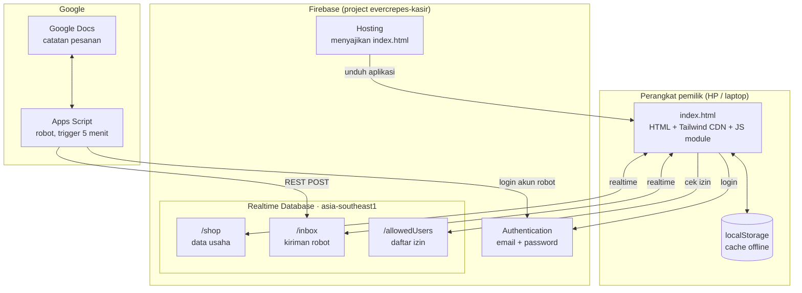

# 4. Arsitektur



## Komponen

| Komponen | Teknologi | Peran |
|---|---|---|
| Aplikasi | Satu file `index.html`: HTML, Tailwind CSS (CDN), JavaScript ES module, Firebase JS SDK 10.13 | Seluruh UI dan logika bisnis, termasuk mesin pembaca Kotak Masuk |
| Cache offline | `localStorage` (key `4ever-crepes-state-v1`) | Data tetap tampil saat offline atau sebelum Firebase tersambung |
| Database | Firebase Realtime Database, region `asia-southeast1` | Sumber data utama, sinkron realtime antar perangkat |
| Autentikasi | Firebase Auth (email + password) + whitelist `/allowedUsers` | Hanya UID yang terdaftar yang bisa membaca/menulis data |
| Hosting | Firebase Hosting, header `no-cache` untuk HTML | Pengguna selalu mendapat versi terbaru setelah deploy |
| Robot | Google Apps Script *standalone*, trigger waktu 5 menit | Memindahkan baris baru dari Google Docs ke `/inbox` |

## Keamanan

**Security rules** (diatur di Firebase Console, tidak ada di repo):

```json
{
  "rules": {
    "allowedUsers": {
      "$uid": { ".read": "auth != null && auth.uid === $uid" }
    },
    "shop": {
      ".read":  "auth != null && root.child('allowedUsers').child(auth.uid).val() === true",
      ".write": "auth != null && root.child('allowedUsers').child(auth.uid).val() === true"
    },
    "inbox": {
      ".read":  "auth != null && root.child('allowedUsers').child(auth.uid).val() === true",
      ".write": "auth != null && root.child('allowedUsers').child(auth.uid).val() === true"
    }
  }
}
```

- Siapa pun bisa mendaftar akun, tetapi tanpa entri di `/allowedUsers` akun itu hanya melihat layar
  **"Akses Ditolak"** (dengan tombol salin UID agar mudah didaftarkan admin).
- Konfigurasi Firebase di `index.html` (apiKey, databaseURL) **memang publik** untuk aplikasi web;
  keamanan bergantung pada rules di atas, bukan pada kerahasiaan konfigurasi.
- Password akun robot disimpan di **Script Properties** Apps Script, tidak pernah di kode.

## Mesin pembaca Kotak Masuk

Logika pencocokan berjalan di aplikasi (bukan di robot), karena aplikasi memegang daftar menu terkini.
Untuk setiap baris:

1. Pecah per koma → setiap potongan = satu item. Potongan pertama juga memuat nama customer.
2. Deteksi jumlah: `x2` / `*2` (pasti jumlah), atau angka polos di akhir (bisa jumlah, bisa bagian nama menu — keduanya dicoba).
3. Cari menu sebagai **akhiran** teks. Sisa teks di depan = nama customer (huruf besar-kecil dipertahankan).
4. Toleransi salah ketik dengan jarak Levenshtein: 0 huruf (nama ≤ 5 karakter), 1 (≤ 10), 2 (lebih panjang).
5. **Aturan keras:** angka pada nama menu harus identik — `28D` tidak pernah dicocokkan dengan `20d`.
6. Bila seri, nama menu **terpanjang** menang (`Peach gum paket` > `Peach gum`).
7. Setiap tebakan yang tidak persis diberi ⚠️. Menu yang tidak ditemukan tidak pernah ditebak.

Diuji dengan 14 kasus, termasuk semua jebakan di atas (14/14 lulus).

---

[← 3. Alur utama](03-alur-utama.md) · [Daftar isi](README.md) · [5. Model data →](05-model-data.md)
